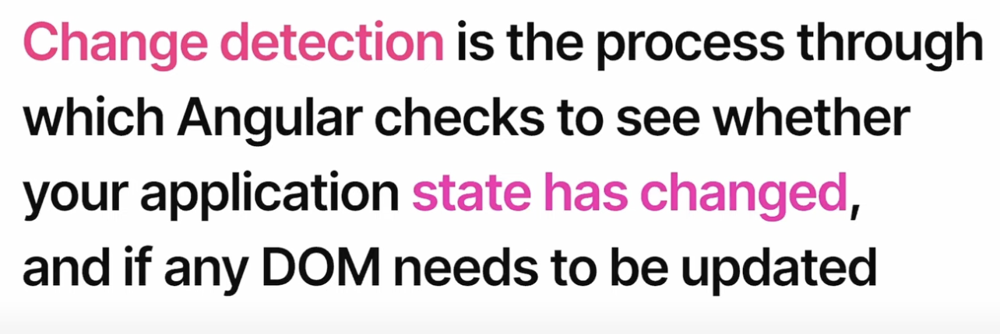
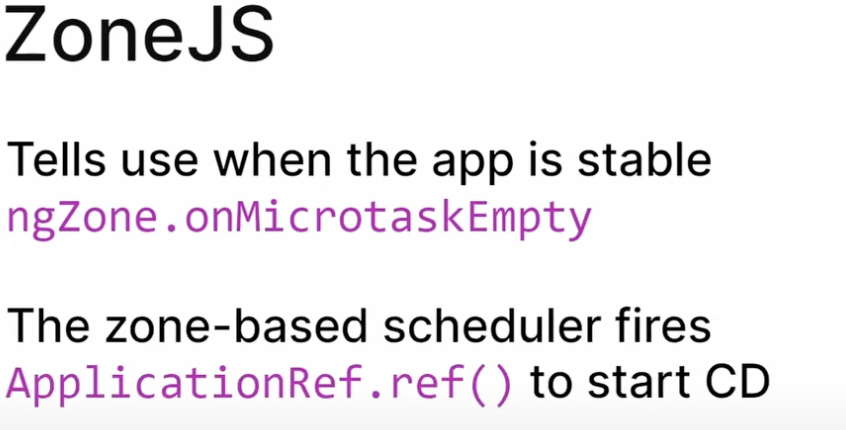
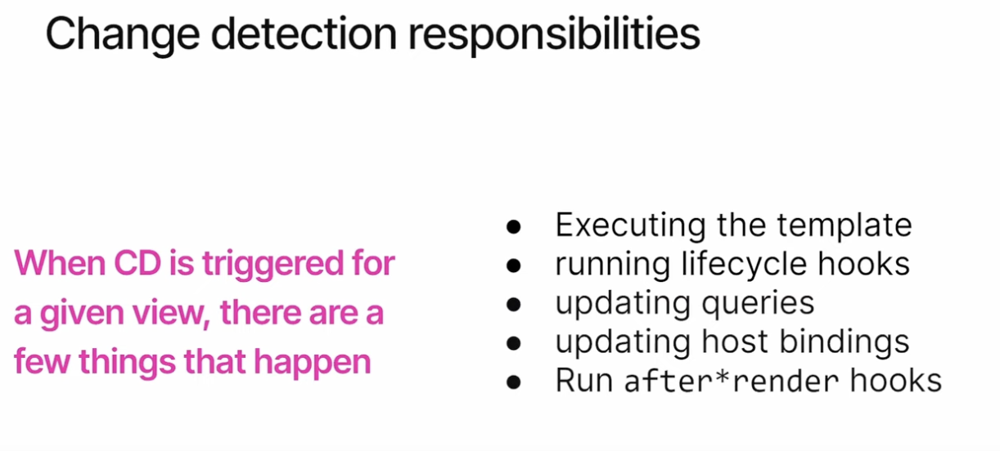
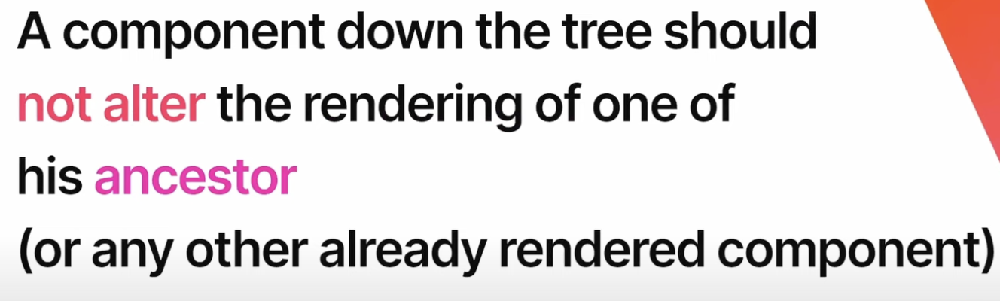
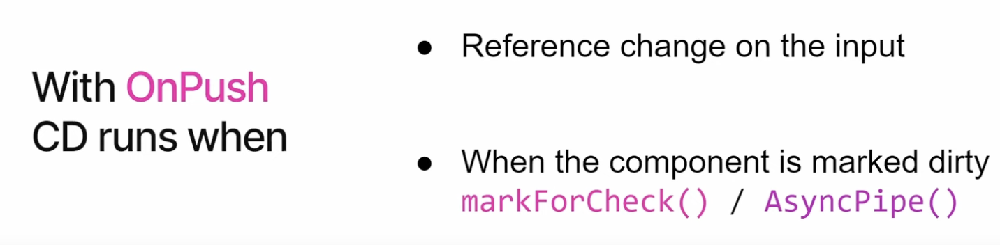

--


---

## UN PO' DI STORIA


### INTRO: I vari annunci e rilasci di NG:

-   06 Feb 2020 - [NG v9](https://blog.angular.io/version-9-of-angular-now-available-project-ivy-has-arrived-23c97b63cfa3) inizio adozione _Ivy_ - periodo stagnazione ~~COVID~~ + lavori interni ViewEngine->Ivy
-   04 Nov 2021 - [NG v13](https://blog.angular.io/angular-v13-is-now-available-cce66f7bc296) **Ivy everywhere** (app+lib)
-   06 Feb 2022 - [RFC](https://blog.angular.io/an-update-on-standalone-components-ea53b4d55214) si inizia a parlare di _Standalone_
-   02 Giu 2022 - [NG v14](https://blog.angular.io/angular-v14-is-now-available-391a6db736af) _preview_ di Standalone comp
-   16 Nov 2022 - [NG v15](https://blog.angular.io/angular-v15-is-now-available-df7be7f2f4c8) stable **Standalone & API**
-   15 Feb 2023 - intro Alex a [Signal](https://github.com/angular/angular/discussions/49090) + discussione [RFC](https://github.com/angular/angular/discussions/49685)
-   03 Mag 2023 - [NG v16](https://blog.angular.io/angular-v16-is-here-4d7a28ec680d) _preview_ di **Signal**, ma manca: signalComponent NG v17/18+ (zoneless in futuro...)

--

## AGENDA


-   FEATURE PRINCIPALI:
    -   **Standalone** Component -(SCAM)-> _optional NgModule_
    -   Migrazione `ng g @angular/core:standalone` + qualche fix: AppComponent + SCAM exports
    -   **StandaloneAPI** ottimizzazione (“tree-shaking”)
        -   nuovo —> _bootstrapApplication_
        -   **provideHttp** + withInterceptorXXX functional
        -   **provideRoute**: nuovo Lazy loadComponent / loadChildren —> ROUTES
        *   inizializzazione withXXX + functional Guard + uso dei providers su Route
    -   **inject** function: dal ctor —> field + infer INJTOKEN + helpers injectParam(name) + attenzione al runInInjectorContext!
-   OPINIONI PERSONALI SU ALTRE FEATURES:
    -   **Signal**: “the elefant in the room” cos’è come lo usiamo adesso e in futuro?!…
    -   Accenni a directiveHosts / strict Typed ReactiveForms / img[ngSrc] & altre utili: _@Input({required}) / withComponentInputBinding / DestroyRef / takeUntilDestoryed_
-   EXTRA: Utilizzo di modern JS tools: esbuild + Vite | CONCLUSIONI: Q & A + Riferimenti

--

## Le basi @NgModule


-   Igor: _“L’errore più grande del Team di Angular”_
-   Ma a cosa serve l’@NgModule:
    -   definizione del contesto di compilazione/scope del template: **declarations, imports, exports**
    -   definizione dei **providers** per inizializzare la DI
    -   entrypoint per **Lazy load** / creazione dinamica

### DECISAMENTE UN PO’ TROPPO!

-   Tra l’altro il tutto con lo scopo di definire/usare i `@Component` che sono i veri _building block_ dell'App

### [DEMO 01](https://github.com/dmorosinotto/XE_Modernize_Angular/compare/00...01) sample NgModule

--

## SCAM


> Soluzione tampone fino a NG13:
> Perchè io e [altri](https://medium.com/marmicode/your-angular-module-is-a-scam-b4136ca3917b) è da un bel pò che vorremmo toglierci di torno gli @NgModule - alla fine ne facciamo centinaia :-/

**SCAM** = **S**ingle **C**omponent **A**ngular ng**M**odule

INLINE nello stesso file del `@Component` per facilitare il riuso+definizione del suo **SCOPE** template/compile!

### [DEMO 02](https://github.com/dmorosinotto/XE_Modernize_Angular/compare/01...02) sample SCAM

--

## Standalone @Component


```diff
@Component({
    selector: "app-some-cmp",
    template: `...`,
+   standalone: true,
+   imports: [OtherStandaloneCmp, LegacyModule, NgIf]
+   /* providers: [...] // EVENTUAL Services/provide rules for DI */
})
export class SomeComponent {...}
```

-   Pieno **INTEROP** con NgModule in **entrambi i versi**!
-   standalone @Directive/@Pipe -> Optional NgModule
    -   più chiare dipendenze dirette (template scope)
    -   più chiaro anche dove definire i providers (DI)
    -   facilita creazione dinamica [VCR](https://v13.angular.io/api/core/ViewContainerRef#createComponent).[createComponet](https://blog.angular.io/angular-v13-is-now-available-cce66f7bc296#8f39)

COMPONENT PILAR: Finalmente i `@Component` sono i **VERI BUILDING BLOCK** delle Applicazioni Angular!

---


--

## MIGRAZIONE - CLI 15.2+

```bash
ng generate @angular/core:standalone
? Choose the type of migration: (Use arrow keys)
❯ Convert all components, directives and pipes to standalone
  Remove unnecessary NgModule classes
  Bootstrap the application using standalone APIs
```

Migrazione in 3 passi + richiede qualche **FIX a mano**:

-   SCAM spostare `providers` su comp prima del 2°
-   AppComponent riportare `imports` deps dopo 3°

### [DEMO 11](https://github.com/dmorosinotto/XE_Modernize_Angular/compare/02...11) migrate 1°

### [DEMO 12](https://github.com/dmorosinotto/XE_Modernize_Angular/compare/11...12) fix SCAM + 2°

### [DEMO 13](https://github.com/dmorosinotto/XE_Modernize_Angular/compare/12...13) fix App.Comp + 3°

--

## StandaloneAPI - provideHttp

-   La migrazione sistema `bootstrapApplication` + usa `provideHttp` ma **NON ROUTING** nuovo!?!
-   Alcune modifiche che possiamo fare:
    -   cambiare AuthInterceptor riscrivendolo in modo **funzionale** + usando _inject()_ per la DI!
    -   utilizzare `withInterceptors` per caricare direttamente la _HttpInterceptorFn_ in alternativa a _withInterceptorsFromDi_ che usava la vecchia class.

### [DEMO 20](https://github.com/dmorosinotto/XE_Modernize_Angular/compare/13...20) provideHttp + InterceptorFn

---


--

## provideRouter + fnGuard

-   Per migliorare "tree-shaking" possiamo usare **provideRouter** ### [DEMO 30](https://github.com/dmorosinotto/XE_Modernize_Angular/compare/20...30)
-   Nuova sintassi **Lazy** `loadChildren` che punta direttamente a _ROUTES_ ### [DEMO 31](https://github.com/dmorosinotto/XE_Modernize_Angular/compare/30...31)
-   Possiamo definire `providers` direttamente nelle _Route_ (elimino NgModule) ### [DEMO 32](https://github.com/dmorosinotto/XE_Modernize_Angular/compare/31...32)
-   Possiamo caricare direttamente `loadComponent` -> Standalone Component ### [DEMO 33](https://github.com/dmorosinotto/XE_Modernize_Angular/compare/32...33) + Semplifico con `export default` ### [DEMO 34](https://github.com/dmorosinotto/XE_Modernize_Angular/compare/33...34)
-   Semplifico scrittura RouteGuard `canXYZ` in modo **funzionale**! ### [DEMO 35](https://github.com/dmorosinotto/XE_Modernize_Angular/compare/34...35) ### [DEMO 36](https://github.com/dmorosinotto/XE_Modernize_Angular/compare/35...36)

--

## NEW DI - inject() [DEMO 40](https://github.com/dmorosinotto/XE_Modernize_Angular/compare/36...40)

```diff
export class InAComponentOrService {
-   constructor(public someService: SomeService) {...} //BEFORE ctor
+   someService = inject(SomeService); //NOW you can use field=inject
}
```

-   Vantaggi: **infer** automatico del tipo di ritorno (utile per `InjectionToken` _type-safe_) ### [DEMO 41](https://github.com/dmorosinotto/XE_Modernize_Angular/compare/40...41)
-   Semplifica caso di classi Ereditate **NON** ho più bisogno di ripassare dipendeze `super(srvBase)`
-   Possibile scrivere **helper** per riutilizzo logica `injectFn` vedi ### [DEMO 42 - initFrm()](https://github.com/dmorosinotto/XE_Modernize_Angular/compare/41...42)
-   ma Attenzione a dove chiamiamo l'helper _injectPar()_ può servire `runInInjectionContext` [DEMO 43](https://github.com/dmorosinotto/XE_Modernize_Angular/compare/42...43)
-   Nuovi **DI pattern** esempio _provideXXX+Config_ [DEMO 44](https://github.com/dmorosinotto/XE_Modernize_Angular/compare/43...44)

---

### Typed ReactiveForms [DEMO 45](https://github.com/dmorosinotto/XE_Modernize_Angular/compare/44...45)


SECONDO ME 👎 1) Sbagliato Naming! 2) Migra `Untyped` 3) troppo **Incasinati** gli oggetti/tipi _strict_ che hanno scritto! 4) **Troppo tardi**! _dopo 7 anni_ molti si son fatti [altre soluzioni](https://github.com/ngneat/reactive-forms) soprattutto per gestire [Form dinamiche](https://formly.dev/)!

--

### hostDirectives ###[DOCS](https://angular.io/guide/directive-composition-api)

-   _Composition vs Inheritance_ per far mix&match di più direttive **standalone** rimappando @Input/@Output

```
@Directive({ standalone:true, ...})
export class Menu { }

@Directive({ standalone: true,...})
export class Tooltip { }

// MenuWithTooltip can compose behaviors from other directives
@Component({
  selector: 'menu-with-tooltip',
  template: './menu-with-tooltip.html',
  hostDirectives: [ Tooltip, {
    directive: Menu,
    inputs: ['menuId: id'],
    outputs: ['menuClosed: closed'],
  }],
})
export class MenuWithTooltipComponent { }
```

--

## NgOptimizedImage ###[DOCS](https://angular.io/api/common/NgOptimizedImage)

-   Utilizzo tag `` per migliorare _LCP_ e gestire in modo ottimizzato il caricamento immagini (preload/lazy)
-   possibilità di impostare _providers_ **IMAGE_LOADER** per utilizzare CDN (es: Cloudflare) o servizi di ContentManagment (es: Cloudinary)


---

## MIGRARE A NG16

```terminal
ng update @angular/cli@16 @angular/core@16
```

La migrazione a NG16 porta alcune **novità utili**:

-   `runInInjectionContext` **fix** _injPar()_ [DEMO 46](https://github.com/dmorosinotto/XE_Modernize_Angular/compare/45...46)
-   `withComponentInputBinding` per passare routerParams/Resolver -> @Input [DEMO 47](https://github.com/dmorosinotto/XE_Modernize_Angular/compare/46...47)
-   @Input({**required**}) con assert automatico e controllo strict del template [DEMO 48](https://github.com/dmorosinotto/XE_Modernize_Angular/compare/47...48)
-   `DestoryRef` per gestire dinamicamente OnDestroy -> utile per implementare tramite _inject()_ il pattern **takeUntilDestory** [DEMO 49](https://github.com/dmorosinotto/XE_Modernize_Angular/compare/48...49)

--

## NOVITA NG16.X: nuova control-flow @syntax

MIGRAZIONE @syntax: `ng generate @angular/core:control-flow`

Qui trovate una [guida/confronto](https://mrrobot.dev/blog/angular-control-flow-deferred-loading) della sintassi vecchia \*ngIf/For/Switch -> nuova control-flow **@syntax** + nuovo uso del `@defer` block con vari [trigger](https://netbasal.com/a-comprehensive-guide-to-angulars-defer-block-468c74048df4)

### [DEMO 61](https://github.com/dmorosinotto/XE_Modernize_Angular/compare/60...61) uso di @if e @else

### [DEMO 62](https://github.com/dmorosinotto/XE_Modernize_Angular/compare/61...62) uso di @for con **track** obbligatorio

### [DEMO 63](https://github.com/dmorosinotto/XE_Modernize_Angular/compare/62...63) uso di @defer per rendere lazy parte del template

--

## NOVITA NG17.X: nuove SingalIO api

MIGRAZIONE "NON UFFICILE" [ng g ngxtension:convert-signal-inputs](https://ngxtension.netlify.app/utilities/migrations/signal-inputs-migration/) + [ng g ngxtension:convert-outputs](https://ngxtension.netlify.app/utilities/migrations/new-outputs-migration/)

### [DEMO 64](https://github.com/dmorosinotto/XE_Modernize_Angular/compare/63...64) best-practices con effect

Esplicitare signal deps + untracked per evitare auto-track di parti non volute [DEEP Articolo OZ su Graph](https://medium.com/@eugeniyoz/angular-signals-reactive-context-and-dynamic-dependency-tracking-d2d6100568b0)

### [DEMO 65](https://github.com/dmorosinotto/XE_Modernize_Angular/compare/64...65) uso di `input()`, `input.required()` e `output()`

### [DEMO 66](https://github.com/dmorosinotto/XE_Modernize_Angular/compare/65...66) uso di `input {trasfrom}` + router `withComponentInputBinding`

### [DEMO 67](https://github.com/dmorosinotto/XE_Modernize_Angular/compare/66...67) uso di `model()` + two-way binding e form

#### REF. Articoli su nuove [SignalIO API V17.1-2](https://www.angularaddicts.com/p/master-angular-17-1-and-17-2):

    -   input, input.required, [model](https://netbasal.com/angulars-model-function-explored-a-comprehensive-overview-4481d023c822),
    - [output](https://netbasal.com/angulars-output-symphony-introducing-the-output-function-5015b1a657e6),
    - + query: [view/contentChild/Children](https://netbasal.com/querying-made-easy-exploring-angulars-query-signals-ca850b5db892)

---

### Extra: utilizzo _modern JS tools_

-   ESbuild 🤯
-   Vite 💚 ⚡️
-   abilitato da standalone + inject

SU `angular.json`

```diff
"architect": {
    "build": {
-       "builder": "@angular-devkit/build-angular:browser",
+       "builder": "@angular-devkit/build-angular:browser-esbuild",
+       "builder": "@angular-devkit/build-angular:application", //for SSR
```

> Le "mie" nuove Best Practices: standalone + inject + helperFn + Signal (dove possibile) + pnpm + vite + ESbuild

---

## SIGNAL - "The 🐘 in the room"

> E' una nuova **PRIMITIVA REACTIVITY** -> con lo scopo di migliorare/rendere la `changeDetection` **puntuale**!

```typescript
const counter = signal(0); //infer WritableSignal<number>
const isOdd = computed(() => !!(counter() % 2)); //infer Signal<boolean>

counter.set(42); //RESETTA VALORE
counter.update((c) => c + 1); //AGGIORNA VALORE

effect(() => {
    //VIENE RICALCOLATO AUTOMATICAMENTE + NOTATE () PER LEGGERE VALORE
    console.log(`Adesso ${counter()} è ${isOdd() ? "dis" : ""}pari`);
});
```

### [DEMO 50](https://github.com/dmorosinotto/XE_Modernize_Angular/compare/49...50) Signal base

[REF. Slide Deborah Kurata](https://bit.ly/ngconf2023) esempi sulle **BASI** signal, computed, effect

--

#### Producer/Consumer + track deps & Notify

-   Praticamente è un **contenitore di valori**
-   che espone un **getter** `()` che ritorna in modo efficace _"memoized"_ il valore corrente, ma internamente fa anche il tracciamento automatico di chi lo va ad utilizzare/leggere -> **computed/effect**
-   ha una serie di metodi per cambiare valore: `set/update` che scatenano **Notifiche** di cambiamento, e fanno partire _"auto-ricalcolo Lazy"_ dei **computed LIVE** ed **effect** [eager dirty _push/pull_ lazy recalc + _glitch-free_](https://priyank-bhardwaj.medium.com/signals-what-new-does-it-bring-to-angular-9d16cc1fc568)

### [DEMO 51](https://github.com/dmorosinotto/XE_Modernize_Angular/compare/50...51) signal authToken + toObservable()

--

### INTEROP con OBS$ [DEMO 52](https://github.com/dmorosinotto/XE_Modernize_Angular/compare/51...52)

```typescript
import { toObservable, toSignal } from "@angular/core/rxjs-interop";
```

-   `toObservable(SIGNAL) -> OBS<T>` Internamente usa un **effect** per reagire ai valori letti dal SIGNAL e pubblicarli sullo stream in uscita --> NECESSITA di esser chiamato in un _InjectionContext_ o in alternativa passare option: `{injector}` da cui viene ricavato `DestroyRef` per fare pulizia quando il contesto termina ossia viene fatto il complete dello stream + destroy dell'effect!
-   `toSignal(OBS) -> SIGNAL<T|undefined>` molto comodo perchè internamente gestisce in **automatico unsubscribe** dell'Observable utilizzando DestroyRef (ricavato in automatico da _InjectionContext_ o dall'`{injector}` passato)! Siccome Observable è _lazy_ ma signal è _syncrono_ (deve avere un valore) di default il signal parte con _undefined_ , ammenoche non si passi option `{initialValue}` oppure si garanteisce che Observable emetta subito un valore `{requireSync:true}`!

### [DEMO 52](https://github.com/dmorosinotto/XE_Modernize_Angular/compare/51...52) toSignal() al posto di |async

### [DEMO 53](https://github.com/dmorosinotto/XE_Modernize_Angular/compare/52...53) exp dynamic computed

### [DEMO 54](https://github.com/dmorosinotto/XE_Modernize_Angular/compare/53...54) exp dynamic effect

---

## ADVANCED: Spiegare il **PERCHE' -> ottimizza ChangeDetection**:

Cos'è Change Detection?


Chi Schedula CD?


Cosa fa CD = Responsabilità?


CD Default -> scorre tutto l'albero


Nostra responsabilità? ->

 un componente figlio non deve modificare dati padre,
Altrimenti Errore -> [ExpressionChangedAfterViewRender](images/ExpressionChanged_NG0100.png)

CD OnPush -> **ottimizzo** OPT-OUT da CD



POssiamo risolvere entrambi i problemi con SIGNAL:
Grazie all'Albero _DependencyGraph_ dei Signal! [CD with Signals](videos/CD_with_Signals.mov)
E MarkForTraversla -> 
In futuro avremo 

#### REF. CD:

-   [Video Matthieu](https://www.youtube.com/watch?v=Jf67ERGwFEM&t=1s) a ngGraz
-   Demo [LIVE CD](https://jeanmeche.github.io/angular-change-detection/)
-   Zoneless / futuro SignalComponent [Slide PLAN v2 by Alex ngVienna](https://docs.google.com/presentation/d/1oc5dO40VANfkmYMFtyz6rstrJdHqV6nOwJluMjIcCkQ/edit?pli=1#slide=id.g262bbab3487_1_530)
-   spiegazione come funziona [DEEP live/consumer by Matthieu](https://riegler.fr/blog/2023-10-24-signals-subscriptions)
-   per i curiosi [DEEP Signal track CD by Vlad](https://medium.com/angularwave/local-change-detection-and-angular-signals-in-templates-in-details-948283adc36d)

---

### [ALCUNE DEMO](src/app/signal) concetti _"avanzati"_:


-   **ATTENZIONE** [Immutability](https://youtu.be/DBZESPS-5mQ) + altrimenti fallisce propagazione delle modifiche a Consumer (computed/effect) [Perchè usa equal](https://github.com/angular/angular/blob/main/packages/core/primitives/signals/src/signal.ts#L68-L71)
    -   VS immer [produce](https://immerjs.github.io/immer/#without-immer) per usare [codice mutabile](https://immerjs.github.io/immer/curried-produce)
    -   VS provare [Trick Sanders](https://github.com/dmorosinotto/SandersTable_signalSample/blob/main/src/app/sample-data.service.ts#L51-L54) set([]) + set(mutato) in sostituzione della `signal.mutate`(computed/effect) perchè sia su signal.set/update e su computed usa **equal**!
-   computed **cached** -> richiamo più volte su template senza prob (=auto distictUntilChange)
-   **glitch-free** (doppio set/update) -> richiama solo ultimo valore computed/effect
    -   [Confronto con BehaviourSubject](https://www.youtube.com/watch?v=iA6iyoantuo) che soffre problema glitch (debounce + distinctUntilChanged)
-   use-case passaggio **injectorCtx / DestroyRef** + [gestione cleanUp](https://github.com/angular/angular/blob/17.3.4/packages/core/src/render3/reactivity/effect.ts#L255-L272)
-   Provare effect che richiama Promise per dettare ritorno dati[] con `allowSignalWrites`
-   Mostrare toObservable -> anche qui **auto unsubscribe** alla fine con DestroyRef (provare con custoom Obs interval con log unsubscribe) -> mostrare toSignal (**auto unsubscribe**)

#### REF. ADVANCED:

-   [Video Guida Rainer](https://www.youtube.com/watch?v=6W6gycuhiN0)
-   [Video Push/Poll by Tomas](https://www.youtube.com/watch?v=sbIlz-yuxQI)
-   [**BESTPRACTICES** by OZ](https://medium.com/@eugeniyoz/angular-signals-best-practices-9ac837ab1cec) ok utilizzo signal su template & computed + Attenzione: a catturare ReactiveContext con effect parte iniziale dipendenze poi usa `untracked`!

---

## Opinione un pò "contrastante":

### PRO:

1. Mi piace **computed** + richiamo `()` su template, che grazie al _"memoize"_ cache dell'utlimo valore calcolato, evita di dover rivalutare/richiamare fn computazione più volte anche se ripetuto nel template, senza bisogno di Pipe o trick `ng-container *ngIf as`!
2. Molto comodo l'uso di `toSignal(obs$)` che gestisce in **automatico unsubscribe** che permette d avere il valore estratto dall'obs$ sempre disponibile anche lato codice senza riccorrere al _subscription |async_ sul template e senza rischiare memory-leak se ci si dimentica di gestire dappertutto il _takeUntilDestory()_
3. Forse essendo una "primitiva reactivity" avremo i maggiori vantaggi nelle integrazioni di nuove lib per **statemanagemnt** -> ritorno `Signal` al posto di Obs$ vedi [ngRxSignalStore](https://github.com/dmorosinotto/NG16-signal-store-playground)

--

### CONTRO:

1. La documentazione è **SCARNA**/_"banale"_ e soprattutto **NON E' CHIARA** su [come usarli](https://angular.dev/guide/signals#use-cases-for-effects) / **anti-pattern** (vedi update immutable / gestione async / effect con allowSignalWrites)
2. I grossi vantaggi (CD granulare) arriveranno in **FUTURO** con `Signal component` NG 17-18+ ed eventuale _Zoneless_ [vedi come abilitare preview by Matthieu](https://riegler.fr/blog/2024-01-11-zoneless-preview)
3. Richiede una **riscrittura** manuale +/- pesante del codice che attualmente è organizzato in base agli Observable RxJS [vedi suggerimenti MikeZ](https://x.com/mikezks/status/1735226934970192241?s=61) su possibili migrazioni su come scatenare CD...
4. Necessità di rivolgersi a **Librerie esterne** per colmare il gap:
    - Nonostante i `Signal` siano alla _base del reactivity system_ per fare [**StateManagement** riassunto](https://offering.solutions/blog/articles/2023/12/03/ngrx-signal-store-getting-started/) bisogna appoggiarsi a librerie esterne che [**prescrivono immutability**](https://ngrx.io/guide/signals/signal-state#updating-state) cone NGRX [`signalStore` by Rainer](https://www.youtube.com/watch?v=V-D2sk_azcs)/[`signalState` by Manfred](https://www.angulararchitects.io/en/blog/the-new-ngrx-signal-store-for-angular-2-1-flavors/) con approccio funzionale o [**class** by Marko](https://x.com/markostdev/status/1727471903462363167?s=61) + eventualmente [`immer`](https://github.com/timdeschryver/ngrx-immer) per facilitare scrittura codice "mutable" e poi convertirlo in "immutable" per signalStore
    - Nonostante ci siano le _basi di interoperabilità con RxJS_ in alcuni casi è necessario usare altri **helpers ngxtensions** come [`derivedFrom`](https://ngxtension.netlify.app/utilities/signals/derived-from/) / [`connect.with`](https://youtu.be/ol671CJnNjY?si=1Tt0u56lYfLLfSgF) idea by [Enea & Chau](https://eneajahollari.medium.com/a-sweet-spot-between-signals-and-observables-a3c9620768f1)...
5. **NON** è ancora chiaro come gestire le **FORM** sembra che l'approccio più semplice sia tornare alle TempalteForm con `[(ngModel)]` con una pletora di signal per singoli per ogni campo, ma bisogna costruirsi un po' di [helper formValueChange](https://youtu.be/ijp_qt3SYl4?si=m5GuatXvh-Vs-nht) per gestire flusso unidir + [computed `viewmodel`](https://youtu.be/ONOtrl6j6Qs?si=PDJPFyJGxWPtSrnQ) per gestire dipendenze tra campi, oppure ricorrere a tentativi/esperimenti "esterni" come [`SignalForm` by Tim](https://timdeschryver.dev/blog/bringing-the-power-of-signals-to-angular-forms-with-signal-forms) ispirate alle ReactiveForm con gestione custom della validazione/errorMsg e la gestione degli stati hide/disable...

Comunque sono sicuramente da tenere d'occhio in questi 1-2anni per capirli bene e prepararsi ad utilizzarli al meglio quando sarà completo il quadro!

---

## CONCLUSIONI + Q&A

-   Come abbiamo visto dopo un periodo stagnante, Angular negli ultimi 2anni ha avuto un grosso speedup nell'introduzione di nuove feature! Nuove funzionalità che lo hanno messo al passo con i tempi e che lo mantengono un **framework moderno**, forse un po' **meno "opinionated"** ma comunque hanno sempre posto la giusta attenzione alla **retro compatibilità** vedi quanto successo con Standalone!

--

-   Per il Futuro di **Signal** stanno seguendo stessi passi: introduzione dell'idea + discussione pubblica RFC e poi si va in preview e ci vogliono mediamente _almeno 2 versioni_ per l'addozione...
    Quindi posso supporre che ci vorrano almeno fino a fine 2023 per una V17 in cui Signal sia più stabile e poi inizio/meta 2024 per una V18+ in cui si vedano i veri vantaggi di Signal, o _forse anche di più_!
-   Perchè come per IVY il passaggio "zone-less" con un nuovo sistema di **ChangeDetection Granuale** è sicuramente qualcosa di pesante cambiare e che impegnerà molto il Team di Angular per esser implementato soprattutto pensando alla retro compatibilità/coesistenza con l'esistente.

--

-   I vantaggi promessi sono interessanti e vedo fermento nella community per questo, anche se sicuramente richiederà anche da parte nostra degli _sforzi/cambiamenti non banali_ per usarlo!
    Comunque l'unico modo che io conosco per ridurre l'impatto di un cambio così importante è quello di partire informati, c'è poco da fare il mondo non si ferma e noi dobbiamo tenerci al passo e cercare di anticipare per quanto possibile le direzioni e per farlo bisogna studiare e darci il tempo di capire come usarlo/sfruttarlo quando sarà disponibile!
    Così sapete cosa fare e non annoiarvi nei prossimi 2anni, o eventualemnte speare che ChatGPT10 faccia tutto per noi 🙃

---

## FEEDBACK & CONTACT


#### Daniele Morosinotto

**Javascript enthusiast**

-   Twitter [@dmorosinotto](https://twitter.com/dmorosinotto)
-   Email [d.morosinotto@icloud.com](d.morosinotto@icloud.com)
-   Repo [https://github.com/dmorosinotto/XE_Modernize_Angular](https://github.com/dmorosinotto/XE_Modernize_Angular)

---

## REFERENCE LINKS

### Standalone

-   Articolo Manferd su [_Utilizzo di standalone_](https://www.angulararchitects.io/en/aktuelles/modern-and-lightweight-angular-architectures-with-angulars-latest-innovations/) per organizzare app Angular 15
-   [Video Alex](https://www.youtube.com/watch?v=kE_zr5ZiPWc) Rickabaugh su standalone
-   Snippet creazione diretta Component su ViewContainerRef [SENZA componentFactoryResolver da V13](https://blog.angular.io/angular-v13-is-now-available-cce66f7bc296#8f39)
-   [Articolo _NX_](https://blog.nrwl.io/component-first-architecture-with-standalone-components-and-nx-c87559af1f91) su architettura standalone + organizzazione codice con Nx
-   Articolo su [_BENEFICI_ Standalone](https://medium.com/ngconf/standalone-angular-nx-414882d8d787) easy organize exp/imp + easy to learn & testing

### Migrazione

-   Articolo su migrazione standalone su Angular 15 con [schematics](https://timdeschryver.dev/blog/i-tried-the-angular-standalone-migration-and-here-is-the-result)
-   Problemi migrazione EnterpriseApp -> Legacy comp/lib che non supportano Ivy [ngcc rimosso da V16](https://itnext.io/upgrading-an-enterprise-app-to-angular-16-4a92b1b29906)

### Standalone API

-   Approfondimento sulle novità del [provideHttp](https://netbasal.com/using-the-angular-http-client-in-angular-v15-f4bec3c11926)
-   Approfondimento sulle novità del [provideRouter](https://blog.angular.io/advancements-in-the-angular-router-5d69ec4c032)
-   Cambiamenti in Angular 14.2 Router [Blog](https://blog.angular.io/advancements-in-the-angular-router-5d69ec4c032)
-   Guida omni-compresiva su come fare [**Config**](https://medium.com/javascript-everyday/angular-apps-configuration-1bbdd6019899) dell'applicazione in Angular 15

## Nuovo DI con inject

-   Articolo su [inject function](https://codereacter.medium.com/why-angular-14s-new-inject-function-is-so-amazing-ac281e7148d1) function e nuovo paradigma DI
-   Come creare il contesto inizializzazione [runInContext](https://netbasal.com/getting-to-know-the-runincontext-api-in-angular-f8996d7e00da)
-   Esempi e casi d'uso di [inject](https://dev.to/this-is-angular/always-use-inject-2do4)
-   Bellissimo articolo Manfred su nuovi [pattern DI](https://www.angulararchitects.io/en/aktuelles/patterns-for-custom-standalone-apis-in-angular/?mc_cid=dcfc4a34f9&mc_eid=bca811da1f) che sfruttano _inject_
-   Angular16 introduce [DestroyRef](https://angular.io/api/core/DestroyRef) per semplificare inject e gestire ngOnDestory -> [takeUntilDestory() by Netbasal](https://netbasal.com/getting-to-know-the-destroyref-provider-in-angular-9791aa096d77?gi=88dd5accb116)

### Altre features

-   Articolo su [TypedReactiveForms](https://blog.angular.io/angular-v14-is-now-available-391a6db736af#e02b) nel rilascio NG14
-   Articolo sull'utilizzo di [TemplateDrive Forms](https://timdeschryver.dev/blog/a-practical-guide-to-angular-template-driven-forms) + [Video](https://youtu.be/7koRJKiBQGA) di Ward Bell sull'argomento!
-   Documentazione ufficiale [NgImageOptimize](https://angular.io/api/common/NgOptimizedImage#description)
-   Rilascio di [Required + route->@Input](https://blog.angular.io/angular-v16-is-here-4d7a28ec680d#d781) introdotti con NG16
-   Novità gestione ngOnDestory -> inject [DestroyRef](https://blog.angular.io/angular-v16-is-here-4d7a28ec680d#2030) + [takeUntilDestoyed](https://angular.io/api/core/rxjs-interop/takeUntilDestroyed) sempre con NG16
-   Novità Angular 16 [GoogleIO video](https://io.google/2023/program/ebab5344-0315-44d2-8923-4571c537e3bb)
-   Riassunto altre novità/[utilità "minori"](https://levelup.gitconnected.com/angular-16-is-making-big-noise-6a06e9808788) Angular16

### Signal "Preview NG16"

-   [RFC Signal](https://github.com/angular/angular/discussions/49685)
-   Manfred [Video uso/conversione](https://www.youtube.com/live/7wfwlAIY4jE?feature=share)
-   Bell'articolo che riassume Signal e meccanismo [Push/Pull](https://priyank-bhardwaj.medium.com/how-angular-signals-solves-an-age-old-problem-ae7ec60f042f) di aggiornamento!
-   Signal demystified articolo per capire quirks [Tomas Trajan](https://angularexperts.io/blog/angular-signals-push-pull)
-   DOCS Ufficiale NG16 [Signals](https://angular.io/guide/signals) + [rxjs-interop](https://angular.io/guide/rxjs-interop)
-   ESEMPIO NG16 [NgRxSignalStore Playground](https://github.com/dmorosinotto/NG16-signal-store-playground)
-   RFC NGRX integrazione [selectSignal](https://github.com/ngrx/platform/discussions/3843) + nuovo [SignalStore](https://github.com/ngrx/platform/discussions/3796)
-   Rilascio NGRX v16 [selectSignal](https://dev.to/ngrx/announcing-ngrx-v16-integration-with-angular-signals-functional-effects-standalone-schematics-and-more-5gk6)
-   Idee simili anche per RFC [MiniRX SignalStore](https://github.com/spierala/mini-rx-store/discussions/188)
-   Bellissimo [VIDEO MANFRED](https://www.youtube.com/watch?v=MaCK8naSH7A) per ispirazione/concetti talk: Standalone / inject + customconfig / Signal basics
-   Bellissimo [REPO MANFRED](https://github.com/manfredsteyer/standalone-example-cli/tree/signal-store) con vari esperimenti uso Signal (ultimo signal-store con nested signal e reattività alla SolidJS)
-   Bellissimo [Video Confronto](https://youtu.be/iA6iyoantuo) BehaviurSubject <-> Signal

### NG V17+ NEWLINKS

-   Articolo Ninja release [RECAP NG17.0](https://blog.ninja-squad.com/2023/11/09/what-is-new-angular-17.0/)
-   V17+ Bellisimo [ARTICOLO COMPLETO](https://mrrobot.dev/blog/angular-control-flow-deferred-loading) su **@-syntax**
-   Guida completa a [**@defer** + condizioni vari `trigger`](https://netbasal.com/a-comprehensive-guide-to-angulars-defer-block-468c74048df4)
-   Blog ufficiale Angular V17+ [Control flow @-syntax](https://blog.angular.io/meet-angulars-new-control-flow-a02c6eee7843)
-   V17+ [@defer LAZY LOAD](https://riegler.fr/blog/2023-10-05-defer-part1)
-   Bell’articolo [confronta \*structuralDir e nuova @-syntax](https://blog.ninja-squad.com/2023/10/11/angular-control-flow-syntax/)
-   Provare nuova [@-syntax Stackblitz](https://stackblitz.com/edit/angular-at?file=package.json)
-   Articolo novità [master NG17](https://www.angularaddicts.com/p/master-angular-17)
-   Articoli [What’s new in NG17.1-2 input()… signal](https://www.angularaddicts.com/p/master-angular-17-1-and-17-2)
-   Articoli What’s new in [NG17.3 output()](https://www.angularaddicts.com/p/whats-new-in-angular-17-3)
-   Articolo NetBasal su [viewChild()](https://netbasal.com/querying-made-easy-exploring-angulars-query-signals-ca850b5db892)
-   Articolo NetBasal sul [model() e [(two-way)]](https://netbasal.com/angulars-model-function-explored-a-comprehensive-overview-4481d023c822) con signal
-   Articolo anche di NetBasal su [output](https://netbasal.com/angulars-output-symphony-introducing-the-output-function-5015b1a657e6)
-   Bell’articolo Enea su [Signal **input.required + computed** ](https://justangular.com/blog/signal-inputs-are-here-to-change-the-game) and computedFrom to mix rxjs async call
-   Bell’articol di Chau su come usare [`runInInjectionContext` per fare **inj helpers**](https://nartc.me/blog/inject-function-the-right-way/)
-   EUREKA Angular come _sostituire @Injectable class X_ -> con coppia **injectX + provideX** basate su function + closure [Video](https://youtu.be/W2fPpXJbUzg?si=PfUYQY4ooUtRpUT4)
-   Bell articolo Tomas su migrazione core [NgModule -> Standalone](https://angularexperts.io/blog/angular-core-module-standalone-migration/) + uso injtoken x fare guard evita doppia registrazione + ENVIRONMENT_INITIALIZER

### SIGNAL NG17 NEWLINKS

-   Slides Debora Kurata [Intro uso Signal](https://bit.ly/ngconf2023)
-   Video Debora Kurata su perché [Immutability](https://youtu.be/DBZESPS-5mQ)
-   **EUREKA** Bellissimo [Video Rainer](https://youtu.be/6W6gycuhiN0?si=cMa1f48KRZG1fyPU) Guida completa a Signal (utile per Corso XE)
-   **EUREKA** Bellisimo [Video Alex](https://youtu.be/_yMrnSa2cTI?si=fBRf1krsCRNQpsI6) su ngOnChange + input signal + deep signals + [Slides ALEX](https://docs.google.com/presentation/d/1oc5dO40VANfkmYMFtyz6rstrJdHqV6nOwJluMjIcCkQ/edit?pli=1#slide=id.g1e556043fbc_0_0) Reactivity Rev2 ngVienna 01-12-2023 da SignalComponent -> SignalIO + zoneless
-   Bell’ articolo di OZ su [**BestPractices Signal**](https://medium.com/@eugeniyoz/angular-signals-best-practices-9ac837ab1cec) e come sfruttare/quando usare computed & effects
-   Lungo articolo di OZ su **DEEP** [automatic dependency graph](https://medium.com/@eugeniyoz/angular-signals-reactive-context-and-dynamic-dependency-tracking-d2d6100568b0) Producer/Consumer e usare untracked sia in effect e computed x escludere rischi auto-track
-   **DEEP** descrizione come funziona Signal [STABLE live/consumer/CD by Mathieu](https://riegler.fr/blog/2023-10-24-signals-subscriptions)
-   **DEEP** nuovo [scheduler per Effect NG17](https://github.com/angular/angular/pull/51049)
-   [Siganl STABLE V17](https://github.com/angular/angular/commit/5b88d136affdaa35e7015c00281b86cae040321b)
-   Articolo [DEEP DIVE Signal - Part 1](https://medium.com/angularwave/deep-dive-into-the-angular-signals-part-1-c6f9c62aea0e)
-   Bellissimo video Reiner su **DEEP** [Signal IMPLEMENTATION](https://www.youtube.com/live/6wWteAza_FY?si=WdlatMJ56_l0vdI3)
-   **DEEP** bellissimo articolo Vlad su cosa son [Signal e implementazione classi interna](https://medium.com/angularwave/introduction-to-angular-signals-e20dba5737db)
-   Interessante articolo su [_common pitfall_](https://medium.com/@eugeniyoz/angular-signals-keeping-the-reactivity-train-c22511e72f5e) con i Signal by OZ
-   Bellissima serie di Articoli by OZ sui Signal:
    -   [State management](https://medium.com/@eugeniyoz/application-state-management-with-angular-signals-b9c8b3a3afd7) con Signal
    -   [Dependency Graph](https://medium.com/@eugeniyoz/dependency-graph-in-angular-signals-53ee47f75e21)
    -   [Signal vs RxJs](https://medium.com/@eugeniyoz/angular-signals-observables-differences-4a0aa7a13bc) differenze
    -   [Exploring intro](https://medium.com/@eugeniyoz/exploring-angular-signals-8a308fd201f4) ai Signal
    -   [Timing](https://medium.com/@eugeniyoz/angular-signals-timing-a875659c5a1a) dei Signal
-   Riassunto Michael su **Signals/Zoneless** link [discussioni su X con Alex](https://x.com/mikezks/status/1735206338324488247?s=61) + come [scatenare **CD**](https://x.com/mikezks/status/1735226934970192241?s=61
-   [**DEEP CD**](https://medium.com/angularwave/local-change-detection-and-angular-signals-in-templates-in-details-948283adc36d) Signals by Vlad
-   Intervista a Minko su [NOVITA ANGULAR V18+](https://youtu.be/2M17gRQbgfI?si=nJ3RzfWS5-CoF1dP)
-   [Angular Zoneless](https://riegler.fr/blog/2024-01-11-zoneless-preview) in preview 17.1-rc0 articolo by Matthieu
-   FUTURO é qui: **NG18 hybrid Zoneless CD** [articolo by Mathieu](https://riegler.fr/blog/2024-04-17-zoneless-with-zoneless-hybrid) + modifica Angular [PR](https://github.com/angular/angular/pull/55102) + snippet uso su X con [esempio uso](https://x.com/jean__meche/status/1780701185898655744?s=61)
-   FUTURO altro bell’articolo Enea sempre su [NEW ERA Zoneless CD](https://justangular.com/blog/a-new-era-for-angular-zoneless-change-detection)

#### STATEMANAGEMENT NGRX/SIGNAL

-   DA VEDERE sessione Manfred su uso **Signal x Statemanagment** basi signal / Servizi con signal / integrazione NGRX toSignal + selectSignal(selector) / final NGRXSignalStore [Video](https://vimeo.com/850102665/83a110562f) + [Slides](https://angularmaster.dev/download/signals-state-management.pdf) + [Repo con vari branch](https://github.com/manfredsteyer/standalone-example-cli)
-   REPO by Michael Zikes con esempio uso **Signal x STATEMANAGEMENT** da NGRX -> Signal -> ngrxSignalState/Store [Slides](https://github.com/dmorosinotto/meetup-signals-state) e [Video](https://www.youtube.com/live/6wWteAza_FY?si=6HGSzpF85Sa0rhSF&t=3590)
-   NGRX 16.3.0 futuro rilascio di [@ngrx/signals](https://github.com/ngrx/platform/blob/main/CHANGELOG.md)
-   EUREKA Implementazioni nuovo **NGRX con Signal** [deepSignal](https://github.com/ngrx/platform/blob/main/modules/signals/src/deep-signal.ts) + [selectSignal](https://github.com/ngrx/platform/blob/main/modules/signals/src/select-signal.ts)
-   Articolo [utilizzo NGRX/signals](https://offering.solutions/blog/articles/2023/12/03/ngrx-signal-store-getting-started/)
-   Figata articolo Manfred **DEEP TS typesafe** per creare [estensione di NGRX/signal](https://www.angulararchitects.io/blog/ngrx-signal-store-deep-dive-flexible-and-type-safe-custom-extensions/) parametrica con “namedProps”
-   NGRX/store come [creare **custom Features**](https://www.angulararchitects.io/en/blog/smarter-not-harder-simplifying-your-application-with-ngrx-signal-store-and-custom-features/) x undo/redo e chiamata Service per chiamare API Smarter - by Manfred
-   EUREKA Manfred spiega **come usare lib @ngrx/signals** The new NGRX Signal Store for Angular: [3+n Flavors](https://www.angulararchitects.io/en/blog/the-new-ngrx-signal-store-for-angular-2-1-flavors/) usando signalState / signalStore + extension callState/Entities alla akita 🤯 + [**approccio a classi by Marko**](https://x.com/markostdev/status/1727471903462363167?s=61) + [VIDEO Manfred](https://www.youtube.com/watch?v=20qgb3-VVjo) DEMO USO @ngrx/signals
-   [Ngrx-immer](https://github.com/timdeschryver/ngrx-immer) per integrazione patchstate/updater mutabili
-   Rilascio ufficiale [NGRX17 @ngrx/signals](https://dev.to/ngrx/announcing-ngrx-v17-introducing-ngrx-signals-operators-performance-improvements-workshops-and-more-55e4)
-   UFFICIALE ngrx/signals package contains **signalStore**, [repo esempio uso by Marko](https://github.com/markostanimirovic/ngrx-signals-example)
-   Video Rainer su [signalStore](https://youtu.be/V-D2sk_azcs?si=NwkyHaFSWGE7lR1Y) + esempio [todo list](https://youtu.be/HqxY0JPlh54?si=p-Tdi162TR14lXX5) con signalStore
-   Angular [Workshop Singals](https://workshops.angulararchitects.io/ms/ng-conf-2024/) + [stackbliz](https://stackblitz.com/~/github.com/manfredsteyer/desserts) by Manfred
-   👀 Stupendo e DETTAGLIATO [Video by Thomas Trajan Dec’23](https://youtu.be/sbIlz-yuxQI?si=d3Ffjlkshq7-eWzv)

#### ALTRE LIB SIGNAL HELPERS

-   Bellssimo articolo Enea su [**computedFrom**](https://eneajahollari.medium.com/a-sweet-spot-between-signals-and-observables-a3c9620768f1) come combinare Obs$ + Signal -> combileLatest + catena pipe() -> toSignal
-   Enea+Chau hanno fatto [LIB HELPER ngxtension](https://github.com/nartc/ngxtension-platform) come computedFrom e altro + Esempio uso su [Stackbliz](https://stackblitz.com/edit/stackblitz-starters-ecylu8?file=src%2Fmain.ts)
-   [Tread](https://twitter.com/Enea_Jahollari/status/1692570021560459307?s=20) su twitter in cui discuto su miglioramenti del codice + [MIO Stackblitz](https://stackblitz.com/edit/stackblitz-starters-tq2wyo?file=src%2FcomputedFrom.ts,src%2Fmain.ts)
-   Figata **connect.with** per sincronizzare signal con Observable + funzione “reducer” per rielaborar signal valore prec+nuovo combinato con obs$ [Video Joshua Morony](https://youtu.be/ol671CJnNjY?si=1Tt0u56lYfLLfSgF)
-   Interessante pattern [auto-signal](https://dev.to/mfp22/introducing-the-auto-signal-pattern-1a5h) per fare connect Obs$ -> Signal senza fare subito subscription, ma defer al 1’ utilizzo + gestisco share/unsub
-   Bellisimo articolo su nuovo [nxRxMiniSignal](https://dev.to/this-is-angular/minirx-signal-store-for-angular-api-preview-4e16)
-   Joshua Moroni [Form with Signals](https://youtu.be/cxoew5rmwFM?si=t8IzMOn1zaCP0PA1) + using [signalSlice](https://youtu.be/z7zK2u4vBrA?si=AopA3aZiAOX_Hdmw)
-   Usare Template form con Signal + helper [**formValueChange**](https://youtu.be/ijp_qt3SYl4?si=m5GuatXvh-Vs-nht) + utilizzo [view model](https://youtu.be/ONOtrl6j6Qs?si=PDJPFyJGxWPtSrnQ)
-   Esempio Sanders che mostra come fare [**Table** signal + zoneless](https://github.com/dmorosinotto/SandersTable_signalSample) mostrato su [Video AngularAir](https://www.youtube.com/live/RpZpWgGqqkE?si=M3j50LtZtZJ6qFcU)

#### SIGNAL EXTRAS

-   [Proposal TC39](https://github.com/proposal-signals/proposal-signals) signal standard JS
-   Bel video 5min che spiega le basi di come [farsi un Signal+computed+effect a mano in js](https://youtube.com/watch?v=bUy4xiJ05KY&si=bgz6SGZ1mZ_ZcP7Q)
-   Bellissimo articolo su [Reactivity System](https://frontendmasters.com/blog/vanilla-javascript-reactivity/) che parla di come implementare i vari sistemi di Reactivity in JS ma nel contempo mostra anche varie cose usabili nativamente nel DOM/Browser con JS (tipo MutationObserver, CustomEvent, Proxy, etc...) veramente figo e interessante (nerd)
-   Riassunto [NgConf 2024](https://lmfinney.wordpress.com/2024/03/26/ng-conf-2024-report/)
-   Signals [FREE CORSE](https://angular-signals.dev/post/welcome)
