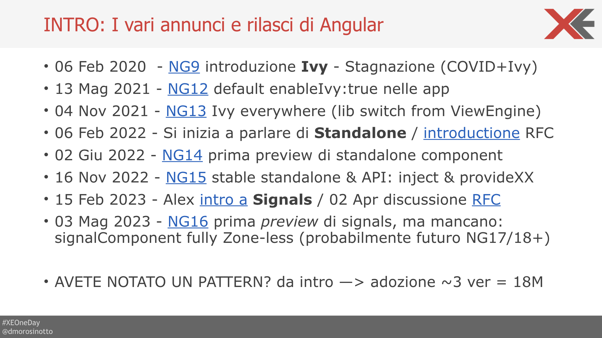
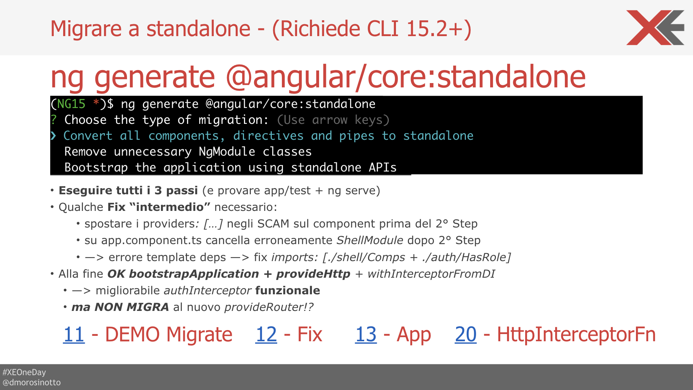

--


---

## UN PO' DI STORIA



### INTRO: I vari annunci e rilasci di NG:

- 06 Feb 2020 - [NG v9](https://blog.angular.io/version-9-of-angular-now-available-project-ivy-has-arrived-23c97b63cfa3) inizio adozione _Ivy_ - periodo stagnazione ~~COVID~~ + lavori interni ViewEngine->Ivy
- 04 Nov 2021 - [NG v13](https://blog.angular.io/angular-v13-is-now-available-cce66f7bc296) **Ivy everywhere** (app+lib)
- 06 Feb 2022 - [RFC](https://blog.angular.io/an-update-on-standalone-components-ea53b4d55214) si inizia a parlare di _Standalone_ 
- 02 Giu 2022 - [NG v14](https://blog.angular.io/angular-v14-is-now-available-391a6db736af) _preview_ di Standalone comp
- 16 Nov 2022 - [NG v15](https://blog.angular.io/angular-v15-is-now-available-df7be7f2f4c8) stable **Standalone & API**
- 15 Feb 2023 - intro Alex a [Signal](https://github.com/angular/angular/discussions/49090) + discussione [RFC](https://github.com/angular/angular/discussions/49685) 
- 03 Mag 2023 - [NG v16](https://blog.angular.io/angular-v16-is-here-4d7a28ec680d) _preview_ di **Signal**, ma manca: signalComponent NG v17/18+ (zoneless in futuro...)

--

## AGENDA


- FEATURE PRINCIPALI:
    - **Standalone** Component -(SCAM)-> _optional NgModule_
    - Migrazione `ng g @angular/core:standalone` + qualche fix: AppComponent + SCAM exports
    - **StandaloneAPI** ottimizzazione (“tree-shaking”) 
        + nuovo —> _bootstrapApplication_
        + **provideHttp** + withInterceptorXXX functional 
        + **provideRoute**: nuovo Lazy loadComponent / loadChildren —> ROUTES
        - inizializzazione withXXX + functional Guard + uso dei providers su Route
    - **inject** function: dal ctor —> field + infer INJTOKEN + helpers injectParam(name) + attenzione al runInInjectorContext!
- OPINIONI PERSONALI SU ALTRE FEATURES:
    - **Signal**: “the elefant in the room” cos’è come lo usiamo adesso e in futuro?!…
    - Accenni a directiveHosts / strict Typed ReactiveForms / img[ngSrc] & altre utili: _@Input({required}) / withComponentInputBinding / DestroyRef / takeUntilDestoryed_
- EXTRA: Utilizzo di modern JS tools: esbuild + Vite | CONCLUSIONI: Q & A + Riferimenti

--

## Le basi @NgModule


- Igor: _“L’errore più grande del Team di Angular”_
- Ma a cosa serve l’@NgModule:
    - definizione del contesto di compilazione/scope del template: **declarations, imports, exports**
    - definizione dei **providers** per inizializzare la DI
    - entrypoint per **Lazy load** / creazione dinamica

### DECISAMENTE UN PO’ TROPPO! 
- Tra l’altro il tutto con lo scopo di definire/usare i `@Component` che sono i veri _building block_ dell'App

### [DEMO 01](https://github.com/dmorosinotto/XE_Modernize_Angular/compare/00...01) sample NgModule

--

## SCAM


> Soluzione tampone fino a NG13: 
Perchè io e [altri](https://medium.com/marmicode/your-angular-module-is-a-scam-b4136ca3917b) è da un bel pò che vorremmo toglierci di torno gli @NgModule - alla fine ne facciamo centinaia :-/   

**SCAM** = **S**ingle **C**omponent **A**ngular ng**M**odule

INLINE nello stesso file del `@Component` per facilitare il riuso+definizione del suo **SCOPE** template/compile! 

### [DEMO 02](https://github.com/dmorosinotto/XE_Modernize_Angular/compare/01...02) sample SCAM

--

## Standalone @Component


```diff
@Component({
    selector: "app-some-cmp",
    template: `...`,
+   standalone: true,
+   imports: [OtherStandaloneCmp, LegacyModule, NgIf]
+   /* providers: [...] // EVENTUAL Services/provide rules for DI */
})
export class SomeComponent {...}
```

- Pieno **INTEROP** con NgModule in **entrambi i versi**!
- standalone @Directive/@Pipe -> Optional NgModule
    - più chiare dipendenze dirette (template scope)
    - più chiaro anche dove definire i providers (DI)
    - facilita creazione dinamica [VCR](https://v13.angular.io/api/core/ViewContainerRef#createComponent).[createComponet](https://blog.angular.io/angular-v13-is-now-available-cce66f7bc296#8f39)

COMPONENT PILAR: Finalmente i `@Component` sono i **VERI BUILDING BLOCK** delle Applicazioni Angular!

---



--

## MIGRAZIONE - CLI 15.2+

```bash
ng generate @angular/core:standalone
? Choose the type of migration: (Use arrow keys)
❯ Convert all components, directives and pipes to standalone 
  Remove unnecessary NgModule classes 
  Bootstrap the application using standalone APIs
```
Migrazione in 3 passi + richiede qualche **FIX a mano**: 
- SCAM spostare `providers` su comp prima del 2°
- AppComponent riportare `imports` deps dopo 3°

### [DEMO 11](https://github.com/dmorosinotto/XE_Modernize_Angular/compare/02...11) migrate 1°
### [DEMO 12](https://github.com/dmorosinotto/XE_Modernize_Angular/compare/11...12) fix SCAM + 2°
### [DEMO 13](https://github.com/dmorosinotto/XE_Modernize_Angular/compare/12...13) fix App.Comp + 3° 

--

## StandaloneAPI - provideHttp

- La migrazione sistema `bootstrapApplication` + usa `provideHttp` ma **NON ROUTING** nuovo!?!
- Alcune modifiche che possiamo fare: 
    - cambiare AuthInterceptor riscrivendolo in modo **funzionale** + usando _inject()_ per la DI!
    - utilizzare `withInterceptors` per caricare direttamente la _HttpInterceptorFn_ in alternativa a _withInterceptorsFromDi_ che usava la vecchia class.

### [DEMO 20](https://github.com/dmorosinotto/XE_Modernize_Angular/compare/13...20) provideHttp + InterceptorFn

---


--

## provideRouter + fnGuard

- Per migliorare "tree-shaking" possiamo usare **provideRouter** ### [DEMO 30](https://github.com/dmorosinotto/XE_Modernize_Angular/compare/20...30)
- Nuova sintassi **Lazy** `loadChildren` che punta direttamente a _ROUTES_ ### [DEMO 31](https://github.com/dmorosinotto/XE_Modernize_Angular/compare/30...31)
- Possiamo definire `providers` direttamente nelle _Route_ (elimino NgModule) ### [DEMO 32](https://github.com/dmorosinotto/XE_Modernize_Angular/compare/31...32)
- Possiamo caricare direttamente `loadComponent` -> Standalone Component ### [DEMO 33](https://github.com/dmorosinotto/XE_Modernize_Angular/compare/32...33) + Semplifico con `export default` ### [DEMO 34](https://github.com/dmorosinotto/XE_Modernize_Angular/compare/33...34)
- Semplifico scrittura RouteGuard `canXYZ` in modo **funzionale**! ### [DEMO 35](https://github.com/dmorosinotto/XE_Modernize_Angular/compare/34...35) ### [DEMO 36](https://github.com/dmorosinotto/XE_Modernize_Angular/compare/35...36)

--

## NEW DI - inject() [DEMO 40](https://github.com/dmorosinotto/XE_Modernize_Angular/compare/36...40)

```diff
export class InAComponentOrService {
-   constructor(public someService: SomeService) {...} //BEFORE ctor
+   someService = inject(SomeService); //NOW you can use field=inject
}
```
- Vantaggi: **infer** automatico del tipo di ritorno (utile per `InjectionToken` _type-safe_) ### [DEMO 41](https://github.com/dmorosinotto/XE_Modernize_Angular/compare/40...41)
- Semplifica caso di classi Ereditate **NON** ho più bisogno di ripassare dipendeze `super(srvBase)`
- Possibile scrivere **helper** per riutilizzo logica `injectFn` vedi ### [DEMO 42 - initFrm()](https://github.com/dmorosinotto/XE_Modernize_Angular/compare/41...42) 
- ma Attenzione a dove chiamiamo l'helper _injectPar()_ può servire `runInInjectionContext` [DEMO 43](https://github.com/dmorosinotto/XE_Modernize_Angular/compare/42...43)
- Nuovi **DI pattern** esempio _provideXXX+Config_ [DEMO 44](https://github.com/dmorosinotto/XE_Modernize_Angular/compare/43...44) 

---

### Typed ReactiveForms [DEMO 45](https://github.com/dmorosinotto/XE_Modernize_Angular/compare/44...45)


SECONDO ME 👎 1) Sbagliato Naming! 2) Migra `Untyped` 3) troppo **Incasinati** gli oggetti/tipi _strict_ che hanno scritto! 4) **Troppo tardi**! _dopo 7 anni_ molti si son fatti [altre soluzioni](https://github.com/ngneat/reactive-forms) soprattutto per gestire [Form dinamiche](https://formly.dev/)!

--

### hostDirectives ###[DOCS](https://angular.io/guide/directive-composition-api)

- _Composition vs Inheritance_ per far mix&match di più direttive **standalone** rimappando @Input/@Output
```
@Directive({ standalone:true, ...})
export class Menu { }

@Directive({ standalone: true,...})
export class Tooltip { }

// MenuWithTooltip can compose behaviors from other directives
@Component({
  selector: 'menu-with-tooltip',
  template: './menu-with-tooltip.html',
  hostDirectives: [ Tooltip, {
    directive: Menu,
    inputs: ['menuId: id'],
    outputs: ['menuClosed: closed'],
  }],
})
export class MenuWithTooltipComponent { }
```

--

## NgOptimizedImage ###[DOCS](https://angular.io/api/common/NgOptimizedImage)
- Utilizzo tag `` per migliorare _LCP_ e gestire in modo ottimizzato il caricamento immagini (preload/lazy) 
- possibilità di impostare _providers_ **IMAGE_LOADER** per utilizzare CDN (es: Cloudflare) o servizi di ContentManagment (es: Cloudinary)


---

## MIGRARE A NG16 

```terminal
ng update @angular/cli@16 @angular/core@16
```

La migrazione a NG16 porta alcune **novità utili**:
- `runInInjectionContext` **fix** _injPar()_ [DEMO 46](https://github.com/dmorosinotto/XE_Modernize_Angular/compare/45...46)
-  `withComponentInputBinding` per passare routerParams/Resolver -> @Input [DEMO 47](https://github.com/dmorosinotto/XE_Modernize_Angular/compare/46...47)
- @Input({**required**}) con assert automatico e controllo strict del template [DEMO 48](https://github.com/dmorosinotto/XE_Modernize_Angular/compare/47...48)
- `DestoryRef` per gestire dinamicamente OnDestroy -> utile per implementare tramite _inject()_ il pattern **takeUntilDestory** [DEMO 49](https://github.com/dmorosinotto/XE_Modernize_Angular/compare/48...49)

--

## SIGNAL - "The 🐘 in the room"
> E' una nuova **PRIMITIVA REACTIVITY** -> con lo scopo di migliorare/rendere la `changeDetection` **puntuale**!

```typescript
const counter = signal(0); //infer WritableSignal<number>
const isOdd = computed(() => !!(counter() % 2)); //infer Signal<boolean>

counter.set(42);            //RESETTA VALORE
counter.update(c => c + 1); //AGGIORNA VALORE

effect(() => { //VIENE RICALCOLATO AUTOMATICAMENTE + NOTATE () PER LEGGERE VALORE
    console.log(`Adesso ${counter()} è ${isOdd()?"dis":""}pari`);
});
```
### [DEMO 50](https://github.com/dmorosinotto/XE_Modernize_Angular/compare/49...50) Signal base

--

#### Producer/Consumer + track deps & Notify

- Praticamente è un **contenitore di valori**
- che espone un **getter** `()` che ritorna in modo efficace _"memoized"_ il valore corrente, ma internamente fa anche il tracciamento automatico di chi lo va ad utilizzare/leggere -> **computed/effect**
- ha una serie di metodi per cambiare valore: `set/update/mutate` che scatenano **Notifiche** di cambiamento, e fanno partire _"auto-ricalcolo Lazy"_ dei **computed** ed **effect** (push/pull + glitch-free)  

### [DEMO 51](https://github.com/dmorosinotto/XE_Modernize_Angular/compare/50...51) signal authToken + toObservable()

--

### INTEROP con OBS$ [DEMO 52](https://github.com/dmorosinotto/XE_Modernize_Angular/compare/51...52)

```typescript
import { toObservable, toSignal } from "@angular/core/rxjs-interop";
```

- `toObservable(SIGNAL) -> OBS<T>` Internamente usa un **effect** per reagire ai valori letti dal SIGNAL e pubblicarli sullo stream in uscita --> NECESSITA di esser chiamato in un _InjectionContext_ o in alternativa passare option: `{injector}`
- `toSignal(OBS) -> SIGNAL<T|undefined>` Internamente gestisce in **automatico unsubscribe** dell'Observable! All'inizio emette undefined perchè Observable è _lazy_ ma signal è _syncrono_ , ammeno che non si passi option `{initialValue}`

### [DEMO 52](https://github.com/dmorosinotto/XE_Modernize_Angular/compare/51...52) toSignal() al posto di |async

--

### Opinione un pò "contrastante":

PRO: 
 
1. Mi piace **computed** + richiamo `()` su template!
2. In prima battuta potrebbe venire comodo per avere nuovo modo di evitare _subscription |async_ usando `toSignal(obs$)` che gestisce in **automatico unsubscribe**
3. Forse essendo una "primitiva reactivity" avremo i maggiori vantaggi nelle integrazioni di nuove lib per **statemanagemnt** -> ritorno `Signal` al posto di Obs$ vedi [ngRxSignalStore](https://github.com/dmorosinotto/NG16-signal-store-playground)
### [DEMO 53](https://github.com/dmorosinotto/XE_Modernize_Angular/compare/52...53) exp dynamic computed

--

CONTRO: ### [DEMO 54](https://github.com/dmorosinotto/XE_Modernize_Angular/compare/53...54) exp dynamic effect
1. **NON** è ancora chiarissimo come usarli / **anti-pattern** (vedi gestione async / effect con writeSignal)
2. I grossi vantaggi (CD granulare)  arriveranno in **FUTURO** con `Signal component` NG 17-18+ 
3. Richiede una **riscrittura** manuale +/- pesante del codice che attualmente è organizzato in base agli Observable RxJS...

Comunque sono sicuramente da tenere d'occhio in questi 1-2anni per capirli bene e prepararsi ad utilizzarli al meglio quando sarà completo il quadro!

---

### Extra: utilizzo _modern JS tools_

-   esbuild 🤯
-   Vite 💚 ⚡️
-   abilitato da standalone + inject 

SU `angular.json`
```diff
"architect": {
    "build": {
-       "builder": "@angular-devkit/build-angular:browser",
+       "builder": "@angular-devkit/build-angular:browser-esbuild",
```

> Le "mie" nuove Best Practices: standalone + inject + helper fn + pnpm + vite + esbuild

---

## CONCLUSIONI + Q&A
- Come abbiamo visto dopo un periodo stagnante, Angular negli ultimi 2anni ha avuto un grosso speedup nell'introduzione di nuove feature! Nuove funzionalità che lo hanno messo al passo con i tempi e che lo mantengono un **framework moderno**, forse un po' **meno "opinionated"** ma comunque hanno sempre posto la giusta attenzione alla **retro compatibilità** vedi quanto successo con Standalone!

--

- Per il Futuro di **Signal** stanno seguendo stessi passi: introduzione dell'idea + discussione pubblica RFC e poi si va in preview e ci vogliono mediamente _almeno 2 versioni_ per l'addozione...
Quindi posso supporre che ci vorrano almeno fino a fine 2023 per una V17 in cui Signal sia più stabile e poi inizio/meta 2024 per una V18+ in cui si vedano i veri vantaggi di Signal, o _forse anche di più_! 
- Perchè come per IVY il passaggio "zone-less" con un nuovo sistema di **ChangeDetection Granuale** è sicuramente qualcosa di pesante cambiare e che impegnerà molto il Team di Angular per esser implementato soprattutto pensando alla retro compatibilità/coesistenza con l'esistente. 

--

- I vantaggi promessi sono interessanti e vedo fermento nella community per questo, anche se sicuramente richiederà anche da parte nostra degli _sforzi/cambiamenti non banali_ per usarlo! 
Comunque l'unico modo che io conosco per ridurre l'impatto di un cambio così importante è quello di partire informati, c'è poco da fare il mondo non si ferma e noi dobbiamo tenerci al passo e cercare di anticipare per quanto possibile le direzioni e per farlo bisogna studiare e darci il tempo di capire come usarlo/sfruttarlo quando sarà disponibile!
Così sapete cosa fare e non annoiarvi nei prossimi 2anni, o eventualemnte speare che ChatGPT10 faccia tutto per noi 🙃

---

## FEEDBACK & CONTACT


#### Daniele Morosinotto

**Javascript enthusiast**

-   Twitter [@dmorosinotto](https://twitter.com/dmorosinotto)
-   Email [d.morosinotto@icloud.com](d.morosinotto@icloud.com)
-   Repo [https://github.com/dmorosinotto/XE_Modernize_Angular](https://github.com/dmorosinotto/XE_Modernize_Angular)


---

## REFERENCE LINKS

### Standalone
- Articolo Manferd su [_Utilizzo di standalone_](https://www.angulararchitects.io/en/aktuelles/modern-and-lightweight-angular-architectures-with-angulars-latest-innovations/) per organizzare app Angular 15
- [Video Alex](https://www.youtube.com/watch?v=kE_zr5ZiPWc)  Rickabaugh su standalone
- Snippet creazione diretta Component su ViewContainerRef [SENZA componentFactoryResolver da V13](https://blog.angular.io/angular-v13-is-now-available-cce66f7bc296#8f39)
- [Articolo _NX_](https://blog.nrwl.io/component-first-architecture-with-standalone-components-and-nx-c87559af1f91) su architettura standalone + organizzazione codice con Nx
- Articolo su [_BENEFICI_ Standalone](https://medium.com/ngconf/standalone-angular-nx-414882d8d787) easy organize exp/imp + easy to learn & testing

### Migrazione
- Articolo su migrazione standalone su Angular 15 con [schematics](https://timdeschryver.dev/blog/i-tried-the-angular-standalone-migration-and-here-is-the-result) 
- Problemi migrazione EnterpriseApp -> Legacy comp/lib che non supportano Ivy [ngcc rimosso da V16](https://itnext.io/upgrading-an-enterprise-app-to-angular-16-4a92b1b29906)

### Standalone API
- Approfondimento sulle novità del [provideHttp](https://netbasal.com/using-the-angular-http-client-in-angular-v15-f4bec3c11926)
- Approfondimento sulle novità del [provideRouter](https://blog.angular.io/advancements-in-the-angular-router-5d69ec4c032)
- Cambiamenti in Angular 14.2 Router [Blog](https://blog.angular.io/advancements-in-the-angular-router-5d69ec4c032) 
- Guida omni-compresiva su come fare [**Config**](https://medium.com/javascript-everyday/angular-apps-configuration-1bbdd6019899) dell'applicazione in Angular 15

## Nuovo DI con inject
- Articolo su [inject function](https://codereacter.medium.com/why-angular-14s-new-inject-function-is-so-amazing-ac281e7148d1) function e nuovo paradigma DI
- Come creare il contesto inizializzazione [runInContext](https://netbasal.com/getting-to-know-the-runincontext-api-in-angular-f8996d7e00da)
- Esempi e casi d'uso di [inject](https://dev.to/this-is-angular/always-use-inject-2do4)
- Bellissimo articolo Manfred su nuovi [pattern DI](https://www.angulararchitects.io/en/aktuelles/patterns-for-custom-standalone-apis-in-angular/?mc_cid=dcfc4a34f9&mc_eid=bca811da1f) che sfruttano _inject_
- Angular16 introduce [DestroyRef](https://angular.io/api/core/DestroyRef) per semplificare inject e gestire ngOnDestory -> [takeUntilDestory() by Netbasal](https://netbasal.com/getting-to-know-the-destroyref-provider-in-angular-9791aa096d77?gi=88dd5accb116)  

### Altre features
- Articolo su [TypedReactiveForms](https://blog.angular.io/angular-v14-is-now-available-391a6db736af#e02b) nel rilascio NG14
- Articolo sull'utilizzo di [TemplateDrive Forms](https://timdeschryver.dev/blog/a-practical-guide-to-angular-template-driven-forms) + [Video](https://youtu.be/7koRJKiBQGA) di Ward Bell sull'argomento!
- Documentazione ufficiale [NgImageOptimize](https://angular.io/api/common/NgOptimizedImage#description)
- Rilascio di [Required + route->@Input](https://blog.angular.io/angular-v16-is-here-4d7a28ec680d#d781) introdotti con NG16
- Novità gestione ngOnDestory -> inject [DestroyRef](https://blog.angular.io/angular-v16-is-here-4d7a28ec680d#2030) + [takeUntilDestoyed](https://angular.io/api/core/rxjs-interop/takeUntilDestroyed) sempre con NG16
- Novità Angular 16 [GoogleIO video](https://io.google/2023/program/ebab5344-0315-44d2-8923-4571c537e3bb)
- Riassunto altre novità/[utilità "minori"](https://levelup.gitconnected.com/angular-16-is-making-big-noise-6a06e9808788) Angular16

### Signal
- [RFC Signal](https://github.com/angular/angular/discussions/49685)
- Manfred [Video uso/conversione](https://www.youtube.com/live/7wfwlAIY4jE?feature=share)
- Bell'articolo che riassume Signal e meccanismo [Push/Pull](https://priyank-bhardwaj.medium.com/how-angular-signals-solves-an-age-old-problem-ae7ec60f042f) di aggiornamento!
- Signal demystified articolo per capire quirks [Tomas Trajan](https://angularexperts.io/blog/angular-signals-push-pull)
- DOCS Ufficiale NG16 [Signals](https://rc.angular.io/guide/) + [rxjs-interop](https://rc.angular.io/guide/rxjs-interop)  
- ESEMPIO NG16 [NgRxSignalStore Playground](https://github.com/dmorosinotto/NG16-signal-store-playground)  
- RFC NGRX integrazione [selectSignal](https://github.com/ngrx/platform/discussions/3843) + nuovo [SignalStore](https://github.com/ngrx/platform/discussions/3796)  
- Rilascio NGRX v16 [selectSignal](https://dev.to/ngrx/announcing-ngrx-v16-integration-with-angular-signals-functional-effects-standalone-schematics-and-more-5gk6)
- Idee simili anche per RFC [MiniRX SignalStore](https://github.com/spierala/mini-rx-store/discussions/188) 
- Bellissimo [VIDEO MANFRED](https://www.youtube.com/watch?v=MaCK8naSH7A ) per ispirazione/concetti talk: Standalone / inject + customconfig / Signal basics
- Bellissimo [REPO MANFRED](https://github.com/manfredsteyer/standalone-example-cli/tree/signal-store) con vari esperimenti uso Signal (ultimo signal-store con nested signal e reattività alla SolidJS)
- Bellissimo [Video Confronto](https://youtu.be/iA6iyoantuo) BehaviurSubject <-> Signal
