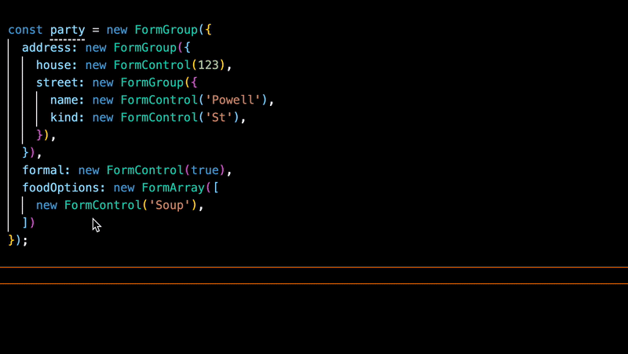

# XE ONE DAY 20/05/2023

## Modernize Angular App

**Daniele Morosinotto**
[@dmorosinotto](https://twitter.com/dmorosinotto)

Repo: [https://github.com/dmorosinotto/XE_Modernize_Angular](https://github.com/dmorosinotto/XE_Modernize_Angular)

--

# AGENDA

INTRO: I vari annunci e rilasci di NG
FEATURE PRINCIPALE DI CUI VOGLIO PARLARE:
    - Standalone Component -(SCAM)-> optional NgModule
    - Migrazione `ng update + ng g @angular/core:standalone` (con qualche problema: UntypedForms / StandaloneAPI provideHttp OK, ma NON migra a provideRoute + qualche FIX AppComponent/SCAM exp)
    - Standalone API = ottimizzazione (Tree Shaking):
        + startup bootstrapApplication con providers 
        + provideHttp + withX + fnInterceptor 
        + provideRoute (+ useX) --> Router nuovi pattern LazyLoad + fnGuard + providers su Ruote
    - inject function: nuova DI ctor->field + infer INJTOKEN + helpers injectParam(name) + attenzione al runInContext!
OPINIONI PERSONALI SU ALTRE FEATURES:
    - Elefant in the room: Signals cosa sono adesso e futuro?!.. 
    - Accenni a: Strict ReactiveForms (gif intellisence troppo tardi) / directiveHosts (composition vs inherit) / img[ngSrc](https://angular.io/api/common/NgOptimizedImage#description) 
    - Novità utili: @Input({required}) / routerParams withComponentInputBinding / DestroyRef / takeUntilDestoryed
EXTRA: Utilizzo modern _JS tools_ esbuild + Vite
CONCLUSIONI:    
-   Q & A
-   Riferimenti

---

# INTRO - *TRACCIA / IDEA*

**IDEA:** Angular stagnante da NG v9 (Feb 2020) -> v13 (Nov 2021) 2/3 anni fermi su IVY
Poi Apr 2022 Alex (cambio Team Lead) inizio parlare di Standalone -> che ha portato poi a fine 2022 al rilascio v14 (preview standalone) e subito dopo v15 RILASCIO novità standalone / inject / Optional NgModel
SPECULAZIONI SUL FUTURO (Magari per le conclusioni...)
Futuro v16 Signal (grande cambio ma non son sicuro perchè Rx molto usato&odiato) stanno seguendo stessi passi: Apr 2023 Alex parla dei concetti di Signal -> RFC pubblica v16 Mag 2023 preview -> entro fine anno 2023-2024 v17 (forse introduzione signal component)/v18+ rilascio completo Signal (SUPPOSIZIONI ma sarà lungo tempo x adozione perchè cambia radicale, pattern non ancora ben chiari in più difficile migrare codebase da Rx->Signal, magari viene comodo x sostiture subscribtion |async usando toSignal, cmq è una primitiva e forse sarà utile "piu utile" nelle nuove lib di Statemanagement)

--

## **REF/SPUNTI** 

UN PO' DI STORIA: I vari annunci / rilasci di NG:
-   Siutazione "stagnante" da [NG v9](https://blog.angular.io/version-9-of-angular-now-available-project-ivy-has-arrived-23c97b63cfa3) con l'introduzione di Ivy 6 Feb 2020
-   Novità di [NG v12](https://blog.angular.io/angular-v12-is-now-available-32ed51fbfd49) default `enableIvy:true` Ivy everywhere 13 Mag 2021
-   Novità di [NG v13](https://blog.angular.io/angular-v13-is-now-available-cce66f7bc296) 4 Nov 2021
-   Introduzione a [standlone](https://blog.angular.io/an-update-on-standalone-components-ea53b4d55214) 6 Feb 2022
-   Novità di [NG v14](https://blog.angular.io/angular-v14-is-now-available-391a6db736af) 2 Giu 2022
-   Novità di [NG v15](https://blog.angular.io/angular-v15-is-now-available-df7be7f2f4c8) 16 Nov 2022
-   Introduzione a [Signal](https://github.com/angular/angular/discussions/49090) 15 Feb 2023 + [RFC](https://github.com/angular/angular/discussions/49685) 3 Apr 2023
-   Novita di [NG v16](https://blog.angular.io/angular-v16-is-here-4d7a28ec680d) 4 Mag 2023

---

# STANDALONE / Optional NgModule - *TRACCIA / IDEA*

**IDEA:** Introdurre Standalone:
- NgModule faceva troppo: contesto template(decl+imp/exp) +DI +Lazy 
- Vecchia soluzione tampone (SCAM) -> 1 NgModule per ogni comp ;-b 
soluzione tampone SCAM -> "NUOVO Mental model"
- Standalone component = Optional NgModule (INTEROP entrambi versi!!)
+ mostrare Migrazione @angular/core:standalone + qualche fix: AppComponent + SCAM exports  

--

## Le basi NgModule

L'errore più grande del Team di Angular [lo hanno ammesso](IGOR TWITTER/VIDEO)  
Ma a cosa serve l'NgModule - Faceva un pò troppo:
-   `declarion + imports + exports` --> definizione del contesto di render/compilazione del template
-   definizione dei providers per la DI
-   Lazy load / creazione dinamica dei componenti

--

## Soluzione tampone fino alla v13: SCAM

Perchè io e [altri](https://medium.com/marmicode/your-angular-module-is-a-scam-b4136ca3917b) è da un bel pò che vorremmo toglierci di torno gli NgModule

SCAM = Single Component Angular Module

Per toglierci di mezzo gli NgModules ne facciamo uno per componente :-)

--

## Mostrare Il "NUOVO Mental model"
-   standalone Component / Directive / Pipe = Optional NgModule
-   Mostrare snippet da NgModel (declaration/import/export) -> nuovo @Component{"standalone": true} 

Si torna alla unica vera idea iniziale "COMPONENT PILAR":
I @Component SONO I VERI BUILDING BLOCK DELLE APP ANGULAR!

- chiarire subito che c'è piena INTEROP con vecchi NgModule 
+ più chiare dipendenze dirette (template scope)
+ più facile parte dinamica: Lazyload (vedi dopo Routing) / [@ViewContainerRef.createComponent](https://v13.angular.io/api/core/ViewContainerRef#createComponent) vedi snippet da V13 si può creare direttamente component [SENZA usare ComponentFactory/NgModule](https://blog.angular.io/angular-v13-is-now-available-cce66f7bc296#8f39)
+ più chiaro anche dove definire i providers (DI) + eventuale mia idea/suggerimento dei <provider-cmp> component con il buco per definire contesto servizi utilizzabili nei figli (ad esempio nella Page di atterraggio del LazyLoad) anche se ora c'è anche idea alternativa di metter i providers direttamente nei Routing (anche qui vedi dopo)

--

## MOSTRARE Migrazione: ng g @angular/core:standalone

- Mostrare diff da NgModule (declaration/import/export) -> nuovo @Component{"standalone": true} 
- boostrapApplication -> OK usa provideHttp, ma NO ROUTING nuovo!!
- Alcuni FIX: AppComponent mancano le dipendenze + SCAM per farli rimuovere bisgona commentare exports e rifare 2° p.to migrazione
FORSE: con SCAM si fa prima a mano... o facendo [schematics NX](https://nx.dev/packages/angular/generators/scam-to-standalone) ad-hoc `npx @ngneat/aim-to-standalone start`

--

## **REF/SPUNTI**

-   Articolo Manferd su [_Utilizzo di standalone_](https://www.angulararchitects.io/en/aktuelles/modern-and-lightweight-angular-architectures-with-angulars-latest-innovations/) per organizzare app Angular 15
-   [video Alex](https://www.youtube.com/watch?v=kE_zr5ZiPWc) Alex Rickabaugh su standalone
- Snippet creazione diretta Component su ViewContainerRef [SENZA componentFactoryResolver da V13](https://blog.angular.io/angular-v13-is-now-available-cce66f7bc296#8f39)
-   [articolo _NX_](https://blog.nrwl.io/component-first-architecture-with-standalone-components-and-nx-c87559af1f91) su architettura standalone + organizzazione codice con Nx
-   Articolo su [_BENEFICI_ Standalone](https://medium.com/ngconf/standalone-angular-nx-414882d8d787) easy organize exp/imp + easy to learn & testing

- Articolo su migrazione standalone su Angular 15 con [schematics](https://timdeschryver.dev/blog/i-tried-the-angular-standalone-migration-and-here-is-the-result) 
- Problemi migrazione EnterpriseApp -> Legacy comp/lib che non supportano Ivy [ngcc rimosso da V16](https://itnext.io/upgrading-an-enterprise-app-to-angular-16-4a92b1b29906)

---

# OTTIMIZZAZIONE - *TRACCIA / IDEA*

**IDEA:** Mostrare come eliminare anche AppModule di partenza utilizzando: 
- boostrapApplication + specificare providers + importProviderFrom(  ngModule_vecchio )
UTILIZZO _provideRoute, provideHttp_ PER RIDURRE BUNDLE (TreeShake):
- provideHttpClient -> treeshake con feature withXSSRF / withInjector/withInjectorFROMCLASS?
    + possibilità di scrivere InjectorFN senza più classi  
- provideRouter -> treeshake con feature withHashLocation / ...
    + possibilità di scrivere GuardFN senza classi + facile da usare direttamente su route (grazie a inject)

--

## REF/SPUNTI
-   approfondimento sulle novità del [provideHttp](https://netbasal.com/using-the-angular-http-client-in-angular-v15-f4bec3c11926)
-   Guida omni-compresiva su come fare [**Config**](https://medium.com/javascript-everyday/angular-apps-configuration-1bbdd6019899) dell'applicazione in Angular 15

---

# ROUTER (NEW LAZY + fnGUARD)  - *TRACCIA / IDEA*

**IDEA:** Mostrare nuova sintassi Route che punta direttametne a Standalone component + lazy _loadComponent_ 
+ lazy _loadChildren_ per caricare array ROUTES
+ mostrare come impostare providers: [] validi per route!
+ Mostrare anche pattern del export default (semplifica lazy)+ suggerimento su come organizzare directory + @pages su tsconfig.json usando path
+ mostrare come ho modificato varie RouteGard: CanLoad->CanMatch su auth.guard.ts + CanActivate/CanDeactivate su cart.route.ts

--

## **REF/SPUNTI**
- blog su cambiamenti in Angular 14.2 Router [Articolo](https://blog.angular.io/advancements-in-the-angular-router-5d69ec4c032) 
-   approfondimento sulle novità del [provideRouter](https://blog.angular.io/advancements-in-the-angular-router-5d69ec4c032)

---

# INJECT - *TRACCIA / IDEA*

**IDEA:** Mostrare nuovi pattern DI con _inject_
- Mostrare snippet per cambiare da costructor -> prop=inject
- Vantaggi/casi d'uso utile:
+ infer del tipo di ritorno (utile soprattutto per caso INJECT TOKEN finalmente type-safe e senza @Inject(TOKEN))  
+ semplifica caso di classi ereditate non più problema del super(con ripassaggio dei servizi a base) 
+ helper injectionFn esempio routerParams che al posto del costruttore mi faccio ingnettare direttamente proprietà 
NOTA: possibile solo nel contesto di inizializzazione (oppure usando `runInInjectionContext(injector,()=>{...})`,
+ Novita Angular16 DestoryRef comodo per generalizzare codice ngOnDetroy -> helper takeUntilDestroy

--

## **REF/SPUNTI**
-   articolo su [inject](https://codereacter.medium.com/why-angular-14s-new-inject-function-is-so-amazing-ac281e7148d1) function e nuovo paradigma DI
-   come creare il contesto inizializzazione [runInContext](https://netbasal.com/getting-to-know-the-runincontext-api-in-angular-f8996d7e00da)
-   esempi e casi d'uso di [inject](https://dev.to/this-is-angular/always-use-inject-2do4)
-   bellissimo articolo Manfred su nuovi [pattern DI](https://www.angulararchitects.io/en/aktuelles/patterns-for-custom-standalone-apis-in-angular/?mc_cid=dcfc4a34f9&mc_eid=bca811da1f) che sfruttano _inject_
- ANGULAR16 DestroyRef per semplificare inject e gestire ngOnDestory -> [takeUntilDestory() by Netbasa](https://netbasal.com/getting-to-know-the-destroyref-provider-in-angular-9791aa096d77?gi=88dd5accb116)  

---

# ALTRE FEATURE: - *TRACCIA / IDEA*
Parlare anche di altre feature (che io trovo meno utili), ma che comuque aprono nuove strade: 
- directiveHosts Composition vs inheritance per far mix&match di piu direttive standalone rimappando/esponendo input&output
- Reactive Forms Strict (hanno sbagliato naming e types)
GIF DEL STICT FORM 
- NgOptimizedImage migliora LCP rimandando caricamento immagini + IMAGE_LOADER custo x Claudinary&Co.

ALTRE NOVITA UTILI:
- @Input({required}) / routerParams withComponentInputBinding / DestroyRef / takeUntilDestoryed

--

## **REF / SPUNTI**
-   articolo sull'utilizzo di [TemplateDrive Forms](https://timdeschryver.dev/blog/a-practical-guide-to-angular-template-driven-forms) + [video](https://youtu.be/7koRJKiBQGA) di Ward Bell sull'argomento!
- articolo su [TypedReactiveForms](https://blog.angular.io/angular-v14-is-now-available-391a6db736af#e02b) nel rilascio NG14
- Documentazione ufficiale [NgImageOptimize](https://angular.io/api/common/NgOptimizedImage#description)
- rilascio di [Required + route->@Input](https://blog.angular.io/angular-v16-is-here-4d7a28ec680d#d781) introdotti con NG16
- novità gestione ngOnDestory -> inject [DestroyRef](https://blog.angular.io/angular-v16-is-here-4d7a28ec680d#2030) + [takeUntilDestoyed](https://angular.io/api/core/rxjs-interop/takeUntilDestroyed) sempre con NG16

---

# SIGNALS: "Elefant in the room"
Spiegare le basi: è una nuova PRIMITIVA per gestire REACTIVITY -> con lo scopo di miglioare la changeDetection rendendola puntuale!
Praticamente è: 
- un contenitore di valori (Producer/Consumer + track deps & Notify)
- che espone un getter () che ritorna in modo efficace "memoized" il valore corrente, ma internamente fa anche il tracciamento automatico di chi lo va ad utilizzare/leggere
- ha una serie di metodi per cambiare valore: set/update/mutate che scatena Notifiche di cambiamento, per far partire auto-ricalcolo Lazy (push/pull che dovrebbe garantire "glitch-free")

Opinione un pò "contrastante" perchè:
0. Mi piace **computed** + richiamo () su template no problem
1. Non è ancora chiaro come usarlo / anti-pattern (vedi gestione async / effect con writeSignal)
2. Il grosso vantaggio arriverà quando avremo Signal component v17-18
3. In prima battuta potrebbe venire comodo per avere nuovo modo di evitare subscription |async usando toSignal(obs) che gestisce in automatico unsubscribe e inolte mi da subito disponibile lato codice/template il valore corrente così da scrivere logica imperativa / computed senza incorrere errori doble-subscribe!
4. Forse essendo una primitiva reactivity avremo i maggiori vantaggi nelle integrazioni di nuove lib per statemanagemnt -> ritorno Signal al posto di Obs vedi ngRxSignalStore
5. Comunque richiede una riscrittura manuale +/- pesante del codice che attualmente è organizzato in base agli Observable RxJS...

Comunque sono sicuramente da tenere d'occhio in questi 1-2anni per capirli bene e prepararsi ad utilizzarli al meglio quando sarà completo il quadro di utilizzo e i vantaggi: Granular CD + Zoneless!

--

## **REF / SPUNTI**
- [RFC Signal](https://github.com/angular/angular/discussions/49685)
- Manfred [Video uso/conversine](https://www.youtube.com/live/7wfwlAIY4jE?feature=share)
- Bell'articolo che riassume Signal e meccanismo [Push/Pull](https://priyank-bhardwaj.medium.com/how-angular-signals-solves-an-age-old-problem-ae7ec60f042f) di aggiornamento!
- Signal demystified articolo per capire quirks [Tomas Trajan](https://angularexperts.io/blog/angular-signals-push-pull)
- DOCS Ufficiale NG16 [Signals](https://rc.angular.io/guide/) + [rxjs-interop](https://rc.angular.io/guide/rxjs-interop)  
- ESEMPIO NG16 [NgRxSignalStore Playground](https://github.com/dmorosinotto/NG16-signal-store-playground)  
- RFC NGRX integrazione [selectSignal](https://github.com/ngrx/platform/discussions/3843) + nuovo [SignalStore](https://github.com/ngrx/platform/discussions/3796)  
- Rilascio NGRX v16 [selectSignal](https://dev.to/ngrx/announcing-ngrx-v16-integration-with-angular-signals-functional-effects-standalone-schematics-and-more-5gk6)
- idee simili anche per RFC [MiniRX SignalStore](https://github.com/spierala/mini-rx-store/discussions/188) 
- Novità Angular 16 [GoogleIO video](https://io.google/2023/program/ebab5344-0315-44d2-8923-4571c537e3bb)
- Riassunto altre novità/[utilità "minori"](https://levelup.gitconnected.com/angular-16-is-making-big-noise-6a06e9808788) Angular16
- Bellissimo [REPO MANFRED](https://github.com/manfredsteyer/standalone-example-cli/tree/signal-store) con vari esperimenti uso Signal (ultimo signal-store con nested signal e reattività alla SolidJS)

---

## Extra: utilizzo _modern JS tools_

-   esbuild 🤯
-   vite 💚 ⚡️
-   abilitato da standalone + inject vedi [articolo](https://marmicode.io/blog/versatile-angular) + [repo](https://github.com/dmorosinotto/Angular_Vite) per provare dal vivo la differenza

---

## Q&A + REFERENCE

Le "mie" nuove Best Practices: standalone + inject + helper fn + pnpm + vite + esbuild
ALCUNI APPROFONDIMENTI:

- Bellissimo [VIDEO MANFRED](https://www.youtube.com/watch?v=MaCK8naSH7A ) per ispirazione/concetti talk: Standalone / inject + customconfig / Signal basics

---

## FEEDBACK & CONTACT

#### Daniele Morosinotto

**Javascript enthusiast**

-   Twitter [@dmorosinotto](https://twitter.com/dmorosinotto)
-   Email [d.morosinotto@icloud.com](d.morosinotto@icloud.com)
-   Repo [https://github.com/dmorosinotto/XE_Modernize_Angular](https://github.com/dmorosinotto/XE_Modernize_Angular)
